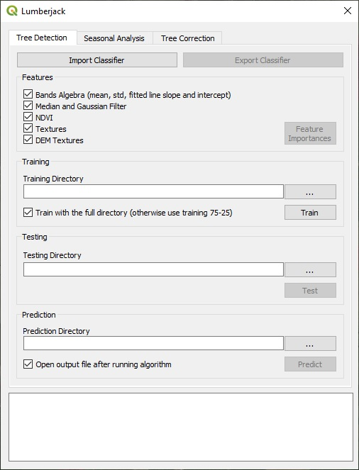
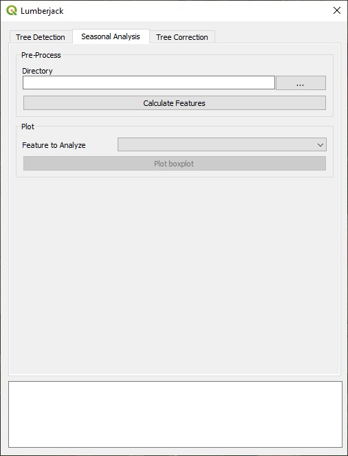

# Lumberjack 

A QGIS plugin to calculate features of images, classify and remove trees out of elevation maps

Author: Carolina Bruscantini, Pablo Rinaldi and Lucas Lo Vercio
bruscantinic@gmail.com
[PLADEMA-UNICEN](http://www.pladema.net/)

<!-- ## Getting Started

These instructions will get you a copy of the project up and running on your local machine for development and testing purposes. See deployment for notes on how to deploy the project on a live system. -->


### Prerequisites

<!--- What things you need to install the software and how to install them -->
* [QGIS Desktop 3 with GRASS](https://www.qgis.org/) - A Free and Open Source Geographic Information System
* [Python 3](https://www.python.org/)
* [NumPy](https://numpy.org/)
* [SciPy](https://www.scipy.org/)
* [scikit-learn](https://scikit-learn.org/stable/)

<!-- ```
Give examples
``` -->

### Installation of python libraries

Open the OsGeo shell (it gets installed with QGIS on a Windows machine) and type:
```bash
py3_env.bat
pip install *name-of-library*
```

### Installation

You can download the repository and add it along with the other python plugins. By default this may be located in:
`C:\OSGeo4W64\apps\qgis\python\plugins` <br/>
If you are not sure about the location, you can:
* Download the repository as a .zip.
* In QGIS go to *Plugins > Manage and Install Plugins > Install from ZIP* and browse the .zip file.
* Click on *Intall Plugin* and accept the security check.

After this, you should be able to see the plugin among the installed ones.

> Do not forget to activate the plugin selecting the checkbox at *Plugins > Manage and Install Plugins > All*. You should be able to see the plugin at the plugins menu ( <kbd>alt</kbd> + <kbd>p</kbd> ).

### A quick glance at a result

|
:-------------------------------:|:-------------------------------:
Before |  After

### How to Use

<!-- 

 -->

The plugin has the three views shown below:

||
:-------------------------------:|:-------------------------------:|:-------------------------------:
Classification |  Threshold Analysis | Tree Correction

The Classification view lets train and test a Random Forest classifier, and predict where trees may be located generating a mask. It also lets save and load classifiers. The Threshold Analysis view lets make an analysis of how different features may vary along time. The Tree Correction view, given an input DEM and a mask, removes trees from a DEM. The plain text edit at the bottom of the window informs metrics. Also, testing generates a bar chart with the feature importances.

|
:-------------------------------:|:-------------------------------:
Feature Importances |  Threshold Analysis of NDVI

In order to automate the processing of the images, directories have to keep certain a format. Each directory hold folders with places. Each place should have a GeoTIFF file defining the extent and folders with the Landsat 8 images as downloaded from USGS. Also, each DEM or Landsat image may have texture features to apply to that place (these can be obtained with the GRASS Script on this repository).<br/>&nbsp;&nbsp;&nbsp;&nbsp;
The basic format looks like:

<pre><code>directory
├───place1
│   │   place1<b>_dem.tif</b>
│   │   place1<b>_dem_text.tif</b>
│   │   place1<b>_reg.tif</b>
│   │   ...
│   │   place1<b>_roi.shp</b>
│   │   ...
│   │   LC08_L1TP_PPPRRR_YYYYMMDD_yyyymmdd_CC_T1<b>_mask.tif</b>
│   │
│   ├───LC08_L1TP_PPPRRR_YYYYMMDD_yyyymmdd_CC_T1
│   │       <b>LC08_L1TP_</b>PPPRRR_YYYYMMDD_yyyymmdd_CC<b>_T1.xml</b>
│   │       <b>LC08_L1TP_</b>PPPRRR_YYYYMMDD_yyyymmdd_CC<b>_T1_ANG.txt</b>
│   │       <b>LC08_L1TP_</b>PPPRRR_YYYYMMDD_yyyymmdd_CC<b>_T1_MTL.txt</b>
│   │       ...
│   │       <b>LC08_L1TP_</b>PPPRRR_YYYYMMDD_yyyymmdd_CC<b>_T1_sr_band1.tif</b>
│   │       ...
│   │       <b>LC08_L1TP_</b>PPPRRR_YYYYMMDD_yyyymmdd_CC<b>_T1_sr_band7.tif</b>
│   │       <b>LC08_L1TP_</b>PPPRRR_YYYYMMDD_yyyymmdd_CC<b>_T1_text.tif</b>
│   │
│   └───LC08_L1TP_PPPRRR_YYYYMMDD_yyyymmdd_CC_T1
│           <b>LC08_L1TP_</b>PPPRRR_YYYYMMDD_yyyymmdd_CC<b>_T1.xml</b>
│           ...
│           <b>LC08_L1TP_</b>PPPRRR_YYYYMMDD_yyyymmdd_CC<b>_T1_sr_band1.tif</b>
│           ...
│           <b>LC08_L1TP_</b>PPPRRR_YYYYMMDD_yyyymmdd_CC<b>_T1_sr_band7.tif</b>
│           <b>LC08_L1TP_</b>PPPRRR_YYYYMMDD_yyyymmdd_CC<b>_T1_text.tif</b>
├───...
└───placeN
    │   placeN<b>_dem.tif</b>
    │   placeN<b>_dem_text.tif</b>
    │   placeN<b>_reg.tif</b>
    │   ...
    │   placeN<b>_roi.shp</b>
    │   ...
    │   LC08_L1TP_PPPRRR_YYYYMMDD_yyyymmdd_CC_T1<b>_mask.tif</b>
    │
    └───LC08_L1TP_PPPRRR_YYYYMMDD_yyyymmdd_CC_T1
            <b>LC08_L1TP_</b>PPPRRR_YYYYMMDD_yyyymmdd_CC<b>_T1.xml</b>
            ...
            <b>LC08_L1TP_</b>PPPRRR_YYYYMMDD_yyyymmdd_CC<b>_T1_sr_band1.tif</b>
            ...
            <b>LC08_L1TP_</b>PPPRRR_YYYYMMDD_yyyymmdd_CC<b>_T1_sr_band7.tif</b>
            <b>LC08_L1TP_</b>PPPRRR_YYYYMMDD_yyyymmdd_CC<b>_T1_text.tif</b> </code> </pre>

The files are:
* ***_sr_bandn.tif**: Each band of the Landsat 8 image is necessary to process the surface reflectance.
* ***_MTL.txt**: This file holds the metadata and lets extract a bit of information about the image.
* ***_reg.tif**: Defines the extent to be used when processing the image. The extent is extracted from the GeoTIFF file.
* ***_dem.tif**: In case textures of the DEM want to be considered, this GeoTIFF is the Digital Elevation Model of a place.
* ***_roi.shp**: This Shapefile defines tree and non-tree polygons. Some examples are located in the _rois_ folder.
* ***_mask.tif**: A GeoTIFF which is usually the result of a prediction and defines if pixels are tree or non-tree pixels.
* ***_text.tif**: This GeoTIFFs are generated with the GRASS script for DEMs and Landsat GeoTIFF files. This files may be used as features.

The table below defines which files are necessary for which task:

|                    |  *_sr_bandn.tif  | *_MTL.txt | *_reg.tif | *_dem.tif | *_roi.shp | *_mask.tif | *_text.tif |
|--------------------|:----------------:|:---------:|:---------:|:---------:|:---------:|:----------:|:----------:|
| Landsat Textures   |         Y        |           |     Y     |           |           |            |            |
| DEM Textures       |                  |     Y     |           |     Y     |           |            |            |
| Training           |         Y        |     Y     |     Y     |           |     Y     |            |     Y/N    |
| Testing            |         Y        |     Y     |     Y     |           |     Y     |            |     Y/N    |
| Predicting         |         Y        |     Y     |     Y     |           |           |            |     Y/N    |
| Threshold Analysis |         Y        |     Y     |     Y     |           |           |      Y     |     Y/N    |


<!-- # Lumberjack  -->

<!--
## Running

Explain how to run the automated tests for this system -->

<!-- ### Break down into end to end tests

Explain what these tests test and why

```
Give an example
``` -->

<!--
## Built With

* [Dropwizard](http://www.dropwizard.io/1.0.2/docs/) - The web framework used
* [Maven](https://maven.apache.org/) - Dependency Management
* [ROME](https://rometools.github.io/rome/) - Used to generate RSS Feeds -->


<!-- ## Versioning

We use [SemVer](http://semver.org/) for versioning. For the versions available, see the [tags on this repository](https://github.com/your/project/tags).  -->


<!-- ## License

This project is licensed under the MIT License - see the [LICENSE.md](LICENSE.md) file for details -->

<!-- ## Acknowledgments

* Hat tip to anyone whose code was used
* Inspiration
* etc -->
